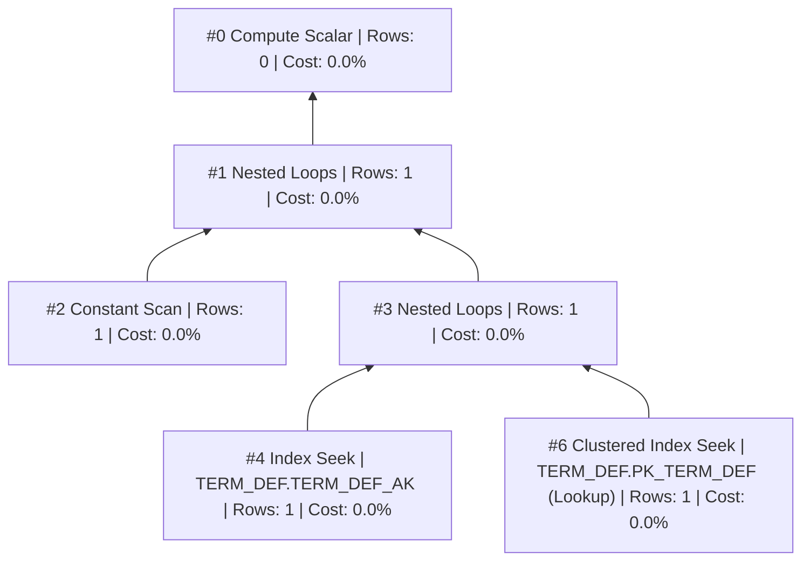
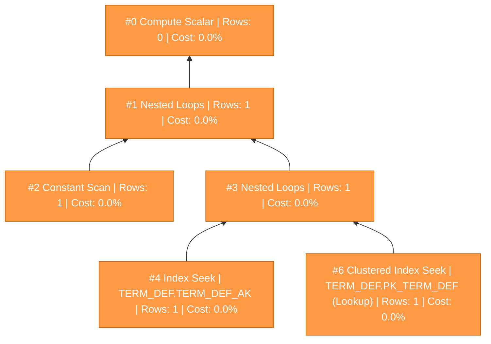
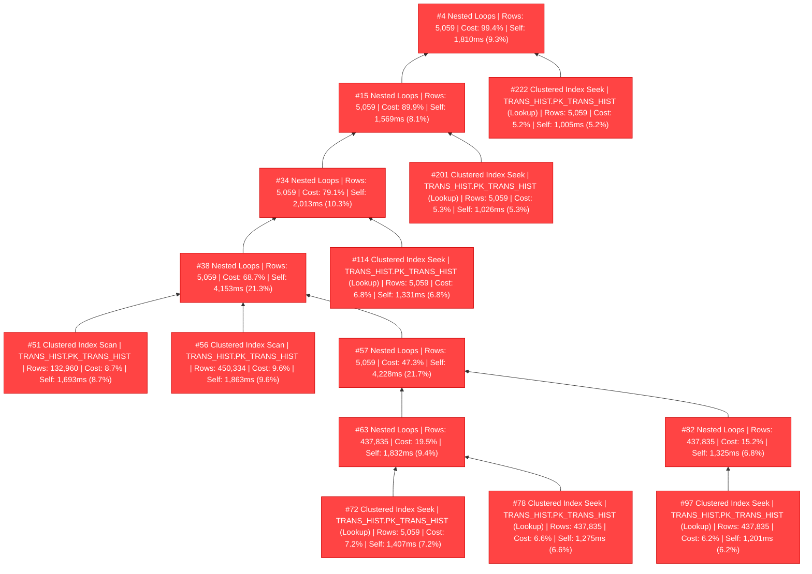

# SQL Execution Plan Analysis

**Source**: `livestats.xml`

---
## Statement 1 (SELECT)

```sql
DECLARE @CurrentTermSort INT = (SELECT TRM_SORT_ORDER FROM TERM_DEF WHERE TRM_CDE = @Term)
```

- **Elapsed**: 0ms | **CPU**: 0ms | **Est. Cost**: 0.00657582

- **DOP**: 1

### Full Execution Plan



### Problematic Nodes (by Exclusive Time)

| Node | Physical Op | Table.Index | Actual Rows | Rows Read | Self Time (ms) | Self % | Elapsed (ms) | Cost % | Logical Reads |
|------|-----------|-------------|-------------|-----------|---------------|--------|-------------|--------|---------------|
| 0 | Compute Scalar |  | 0 | 0 | 0 | 0.0% | 0 | 0.0% | 0 |
| 1 | Nested Loops |  | 1 | 0 | 0 | 0.0% | 0 | 0.0% | 0 |
| 2 | Constant Scan |  | 1 | 0 | 0 | 0.0% | 0 | 0.0% | 0 |
| 3 | Nested Loops |  | 1 | 0 | 0 | 0.0% | 0 | 0.0% | 0 |
| 4 | Index Seek | TERM_DEF.TERM_DEF_AK | 1 | 1 | 0 | 0.0% | 0 | 0.0% | 2 |
| 6 | Clustered Index Seek | TERM_DEF.PK_TERM_DEF (Lookup) | 1 | 1 | 0 | 0.0% | 0 | 0.0% | 2 |

#### Details

**Node 0 — Compute Scalar** (Self: 0ms / 0.0%)
- Actual rows: 0 | Rows read: 0
- Executions: 0
- Logical reads: 0 | Physical reads: 0
- Elapsed: 0ms (self: 0ms) | CPU: 0ms

**Node 1 — Nested Loops** (Self: 0ms / 0.0%)
- Actual rows: 1 | Rows read: 0
- Executions: 1
- Logical reads: 0 | Physical reads: 0
- Elapsed: 0ms (self: 0ms) | CPU: 0ms

**Node 2 — Constant Scan** (Self: 0ms / 0.0%)
- Actual rows: 1 | Rows read: 0
- Executions: 1
- Logical reads: 0 | Physical reads: 0
- Elapsed: 0ms (self: 0ms) | CPU: 0ms

**Node 3 — Nested Loops** (Self: 0ms / 0.0%)
- Actual rows: 1 | Rows read: 0
- Executions: 1
- Logical reads: 0 | Physical reads: 0
- Elapsed: 0ms (self: 0ms) | CPU: 0ms

**Node 4 — Index Seek** (Self: 0ms / 0.0%)
- Table: `TERM_DEF`
- Index: `TERM_DEF_AK`
- Actual rows: 1 | Rows read: 1
- Executions: 1
- Logical reads: 2 | Physical reads: 0
- Elapsed: 0ms (self: 0ms) | CPU: 0ms

**Node 6 — Clustered Index Seek** (Self: 0ms / 0.0%)
- Table: `TERM_DEF`
- Index: `PK_TERM_DEF`
- **Key Lookup** — consider covering index to avoid lookups
- Actual rows: 1 | Rows read: 1
- Executions: 1
- Logical reads: 2 | Physical reads: 0
- Elapsed: 0ms (self: 0ms) | CPU: 0ms

### Problematic Nodes Diagram



---
## Statement 2 (SELECT)

```sql
WITH peeps (ID_NUM) AS
        (
            SELECT DISTINCT sm.ID_NUM
            FROM STUDENT_MASTER sm
                INNER JOIN TRANS_HIST th ON sm.ID_NUM = th.ID_NUM
            WHERE th.CHG_YR_TRAN_HIST = @Year
                AND th.CHG_TRM_TRAN_HIST = @Term
        ),
        tranData (ID_NUM, TransPeriod, TransType, Amount) AS
        (
            SELECT
                th.ID_NUM,
                CASE
                    WHEN th.SUBSID_CDE IN ('AA')
                        AND (
     ...
```

- **Elapsed**: 19,955ms | **CPU**: 19,456ms | **Est. Cost**: 1951.96

- **DOP**: 0
- **Memory Grant**: 948,640 KB (Used: 42,552 KB, 4%)
- **Non-Parallel Reason**: CouldNotGenerateValidParallelPlan

### Warnings

- **PlanAffectingConvert**: ConvertIssue=Cardinality Estimate | Expression=CONVERT(varchar(30),[Expr1124],0)
- **MemoryGrantWarning**: GrantWarningKind=Excessive Grant | RequestedMemory=948640 | GrantedMemory=948640 | MaxUsedMemory=42552
- **SpillToTempDb**: SpillLevel=1 | SpilledThreadCount=1
- **HashSpillDetails**: GrantedMemoryKb=1088 | UsedMemoryKb=1032 | WritesToTempDb=216 | ReadsFromTempDb=216

### Missing Index Suggestions

  - **Table**: `TmsEPrd.dbo.TRANS_HIST` (Impact: 32.2897%)
    - Equality: `OFFSET_FLAG`
    - Inequality: `OI_ALLOCATION`
    - Include: `SOURCE_CDE, TRANS_AMT, ID_NUM, SUBSID_CDE, CHG_TRM_TRAN_HIST, CHG_YR_TRAN_HIST`
  - **Table**: `TmsEPrd.dbo.TRANS_HIST` (Impact: 32.5732%)
    - Equality: `CHG_TRM_TRAN_HIST, CHG_YR_TRAN_HIST`
    - Include: `ID_NUM`

### Wait Statistics

| Wait Type | Time (ms) | Count |
|-----------|-----------|-------|
| ASYNC_NETWORK_IO | 464 | 40 |
| SOS_SCHEDULER_YIELD | 13 | 4846 |
| RESERVED_MEMORY_ALLOCATION_EXT | 12 | 15913 |
| MEMORY_ALLOCATION_EXT | 8 | 9845 |
| PAGEIOLATCH_SH | 1 | 4 |

### Full Execution Plan

```mermaid
flowchart BT
    S2N0["#0 Sort | Rows: 5,059 | Cost: 0.0%"]
    S2N1["#1 Compute Scalar | Rows: 5,059 | Cost: 0.1%"]
    S2N2["#2 Hash Match | Rows: 5,059 | Cost: 100.0% | Self: 121ms (0.6%)"]:::warm
    S2N3["#3 Compute Scalar | Rows: 0 | Cost: 99.4%"]:::warm
    S2N4["#4 Nested Loops | Rows: 5,059 | Cost: 99.4% | Self: 1,810ms (9.3%)"]:::hot
    S2N5["#5 Merge Join | Rows: 5,059 | Cost: 90.1% | Self: 38ms (0.2%)"]:::warm
    S2N6["#6 Compute Scalar | Rows: 0 | Cost: 0.2%"]
    S2N7["#7 Stream Aggregate | Rows: 14,315 | Cost: 0.2% | Self: 3ms (0.0%)"]
    S2N8["#8 Stream Aggregate | Rows: 19,383 | Cost: 0.2% | Self: 19ms (0.1%)"]
    S2N9["#9 Sort | Rows: 19,598 | Cost: 0.0%"]
    S2N11["#11 Hash Match | Rows: 19,598 | Cost: 0.0%"]
    S2N12["#12 Index Scan | HOLD_TRAN.J1dxM1_HldTran_COL_2_6_7 | Rows: 19,598 | Cost: 0.1% | Self: 14ms (0.1%)"]
    S2N14["#14 Index Scan | HOLD_TRAN.J1dxFK_HldTran_HOLD_CDE | Rows: 19,598 | Cost: 0.0% | Self: 9ms (0.0%)"]
    S2N15["#15 Nested Loops | Rows: 5,059 | Cost: 89.9% | Self: 1,569ms (8.1%)"]:::hot
    S2N16["#16 Merge Join | Rows: 5,059 | Cost: 81.8% | Self: 51ms (0.3%)"]:::warm
    S2N17["#17 Merge Join | Rows: 5,059 | Cost: 81.6% | Self: 73ms (0.4%)"]:::warm
    S2N18["#18 Merge Join | Rows: 5,059 | Cost: 81.2% | Self: 84ms (0.4%)"]:::warm
    S2N19["#19 Clustered Index Scan | BIOGRAPH_MASTER.PK_BIOGRAPH_MASTER | Rows: 595,293 | Cost: 0.3% | Self: 61ms (0.3%)"]
    S2N20["#20 Merge Join | Rows: 5,059 | Cost: 80.7% | Self: 93ms (0.5%)"]:::warm
    S2N21["#21 Sort | Rows: 43,200 | Cost: 0.0%"]
    S2N23["#23 Hash Match | Rows: 43,573 | Cost: 0.0%"]
    S2N24["#24 Index Scan | AlternateContactMethod.AlternateContactMethod_AppID_w_Include | Rows: 43,573 | Cost: 0.2% | Self: 40ms (0.2%)"]
    S2N26["#26 Index Scan | AlternateContactMethod.J1dxM1_AltCtcMthd_AlternateContact | Rows: 43,573 | Cost: 0.2% | Self: 33ms (0.2%)"]
    S2N27["#27 Merge Join | Rows: 5,059 | Cost: 80.3% | Self: 220ms (1.1%)"]:::warm
    S2N28["#28 Sort | Rows: 362,700 | Cost: 0.4% | Self: 27ms (0.1%)"]
    S2N30["#30 Hash Match | Rows: 363,293 | Cost: 0.1%"]
    S2N31["#31 Index Scan | AlternateContactMethod.AlternateContactMethod_AppID_w_Include | Rows: 363,293 | Cost: 0.2% | Self: 35ms (0.2%)"]
    S2N33["#33 Index Scan | AlternateContactMethod.J1dxM1_AltCtcMthd_AlternateContact | Rows: 363,293 | Cost: 0.2% | Self: 44ms (0.2%)"]
    S2N34["#34 Nested Loops | Rows: 5,059 | Cost: 79.1% | Self: 2,013ms (10.3%)"]:::hot
    S2N35["#35 Nested Loops | Rows: 5,059 | Cost: 68.8% | Self: 25ms (0.1%)"]:::warm
    S2N37["#37 Sort | Rows: 5,059 | Cost: 0.0%"]
    S2N38["#38 Nested Loops | Rows: 5,059 | Cost: 68.7% | Self: 4,153ms (21.3%)"]:::hot
    S2N40["#40 Hash Match | Rows: 5,059 | Cost: 0.1%"]
    S2N41["#41 Clustered Index Scan | DEGREE_HISTORY.PK_DEGREE_HISTORY | Rows: 113,216 | Cost: 0.2% | Self: 31ms (0.2%)"]
    S2N42["#42 Hash Match | Rows: 5,059 | Cost: 47.3%"]
    S2N43["#43 Filter | Rows: 5,061 | Cost: 0.1%"]
    S2N44["#44 Hash Match | Rows: 5,395 | Cost: 0.1%"]
    S2N45["#45 Compute Scalar | Rows: 450,334 | Cost: 1.5%"]
    S2N46["#46 Hash Match | Rows: 450,334 | Cost: 0.1%"]
    S2N47["#47 Clustered Index Scan | TERM_DEF.PK_TERM_DEF | Rows: 4 | Cost: 0.0%"]
    S2N48["#48 Hash Match | Rows: 450,334 | Cost: 0.0%"]
    S2N50["#50 Hash Match | Rows: 5,396 | Cost: 0.0%"]
    S2N51["#51 Clustered Index Scan | TRANS_HIST.PK_TRANS_HIST | Rows: 132,960 | Cost: 8.7% | Self: 1,693ms (8.7%)"]:::hot
    S2N53["#53 Index Scan | STUDENT_MASTER.J1dxM1_StuMst_M1 | Rows: 5,396 | Cost: 0.0% | Self: 4ms (0.0%)"]
    S2N55["#55 Compute Scalar | Rows: 450,334 | Cost: 0.9%"]
    S2N56["#56 Clustered Index Scan | TRANS_HIST.PK_TRANS_HIST | Rows: 450,334 | Cost: 9.6% | Self: 1,863ms (9.6%)"]:::hot
    S2N57["#57 Nested Loops | Rows: 5,059 | Cost: 47.3% | Self: 4,228ms (21.7%)"]:::hot
    S2N58["#58 Nested Loops | Rows: 5,059 | Cost: 25.6% | Self: 25ms (0.1%)"]
    S2N59["#59 Filter | Rows: 5,059 | Cost: 0.1%"]
    S2N60["#60 Clustered Index Scan | STUDENT_MASTER.PK_STUDENT_MASTER | Rows: 5,061 | Cost: 0.1% | Self: 16ms (0.1%)"]
    S2N61["#61 Stream Aggregate | Rows: 5,059 | Cost: 25.5% | Self: 303ms (1.6%)"]
    S2N62["#62 Nested Loops | Rows: 437,835 | Cost: 23.9% | Self: 858ms (4.4%)"]
    S2N63["#63 Nested Loops | Rows: 437,835 | Cost: 19.5% | Self: 1,832ms (9.4%)"]:::hot
    S2N65["#65 Top | Rows: 5,059 | Cost: 10.1% | Self: 2ms (0.0%)"]
    S2N66["#66 Nested Loops | Rows: 5,059 | Cost: 10.1% | Self: 17ms (0.1%)"]
    S2N67["#67 Index Seek | STUDENT_MASTER.STUDENT_MASTER_AK | Rows: 5,059 | Cost: 0.1% | Self: 12ms (0.1%)"]
    S2N68["#68 Nested Loops | Rows: 5,059 | Cost: 10.0% | Self: 535ms (2.7%)"]
    S2N70["#70 Index Seek | TRANS_HIST.TRANS_HIST_FK7 | Rows: 743,396 | Cost: 2.0% | Self: 398ms (2.0%)"]
    S2N72["#72 Clustered Index Seek | TRANS_HIST.PK_TRANS_HIST (Lookup) | Rows: 5,059 | Cost: 7.2% | Self: 1,407ms (7.2%)"]:::hot
    S2N73["#73 Compute Scalar | Rows: 0 | Cost: 9.3%"]
    S2N74["#74 Nested Loops | Rows: 437,835 | Cost: 9.3% | Self: 532ms (2.7%)"]
    S2N76["#76 Index Seek | TRANS_HIST.TRANS_HIST_FK7 | Rows: 879,207 | Cost: 1.7% | Self: 325ms (1.7%)"]
    S2N78["#78 Clustered Index Seek | TRANS_HIST.PK_TRANS_HIST (Lookup) | Rows: 437,835 | Cost: 6.6% | Self: 1,275ms (6.6%)"]:::hot
    S2N79["#79 Clustered Index Scan | TERM_DEF.PK_TERM_DEF | Rows: 1,751,340 | Cost: 3.7% | Self: 727ms (3.7%)"]
    S2N80["#80 Stream Aggregate | Rows: 5,059 | Cost: 21.7% | Self: 451ms (2.3%)"]
    S2N81["#81 Nested Loops | Rows: 437,835 | Cost: 19.4% | Self: 815ms (4.2%)"]
    S2N82["#82 Nested Loops | Rows: 437,835 | Cost: 15.2% | Self: 1,325ms (6.8%)"]:::hot
    S2N84["#84 Top | Rows: 5,059 | Cost: 6.7% | Self: 3ms (0.0%)"]
    S2N85["#85 Nested Loops | Rows: 5,059 | Cost: 6.7% | Self: 16ms (0.1%)"]
    S2N86["#86 Index Seek | STUDENT_MASTER.STUDENT_MASTER_AK | Rows: 5,059 | Cost: 0.1% | Self: 14ms (0.1%)"]
    S2N87["#87 Nested Loops | Rows: 5,059 | Cost: 6.6% | Self: 324ms (1.7%)"]
    S2N89["#89 Index Seek | TRANS_HIST.TRANS_HIST_FK7 | Rows: 743,396 | Cost: 1.1% | Self: 215ms (1.1%)"]
    S2N91["#91 Clustered Index Seek | TRANS_HIST.PK_TRANS_HIST (Lookup) | Rows: 5,059 | Cost: 4.9% | Self: 963ms (4.9%)"]
    S2N92["#92 Compute Scalar | Rows: 0 | Cost: 8.4%"]
    S2N93["#93 Nested Loops | Rows: 437,835 | Cost: 8.4% | Self: 427ms (2.2%)"]
    S2N95["#95 Index Seek | TRANS_HIST.TRANS_HIST_FK7 | Rows: 879,207 | Cost: 1.2% | Self: 241ms (1.2%)"]
    S2N97["#97 Clustered Index Seek | TRANS_HIST.PK_TRANS_HIST (Lookup) | Rows: 437,835 | Cost: 6.2% | Self: 1,201ms (6.2%)"]:::hot
    S2N98["#98 Clustered Index Scan | TERM_DEF.PK_TERM_DEF | Rows: 1,751,340 | Cost: 3.6% | Self: 695ms (3.6%)"]
    S2N99["#99 Index Seek | NameMaster.NameMaster_AK | Rows: 5,059 | Cost: 0.1% | Self: 10ms (0.1%)"]
    S2N101["#101 Clustered Index Seek | NameMaster.PK_NameMaster (Lookup) | Rows: 5,059 | Cost: 0.1% | Self: 16ms (0.1%)"]
    S2N102["#102 Row Count Spool | Rows: 5,059 | Cost: 10.3%"]
    S2N104["#104 Top | Rows: 5,059 | Cost: 10.3% | Self: 1ms (0.0%)"]
    S2N105["#105 Nested Loops | Rows: 5,059 | Cost: 10.3% | Self: 33ms (0.2%)"]
    S2N107["#107 Top | Rows: 5,059 | Cost: 10.1%"]
    S2N108["#108 Nested Loops | Rows: 5,059 | Cost: 10.1% | Self: 5ms (0.0%)"]
    S2N109["#109 Index Seek | STUDENT_MASTER.STUDENT_MASTER_AK | Rows: 5,059 | Cost: 0.0% | Self: 5ms (0.0%)"]
    S2N110["#110 Nested Loops | Rows: 5,059 | Cost: 10.1% | Self: 638ms (3.3%)"]
    S2N112["#112 Index Seek | TRANS_HIST.TRANS_HIST_FK7 | Rows: 743,396 | Cost: 2.6% | Self: 513ms (2.6%)"]
    S2N114["#114 Clustered Index Seek | TRANS_HIST.PK_TRANS_HIST (Lookup) | Rows: 5,059 | Cost: 6.8% | Self: 1,331ms (6.8%)"]:::hot
    S2N116["#116 Top | Rows: 5,059 | Cost: 0.1%"]
    S2N117["#117 Nested Loops | Rows: 5,059 | Cost: 0.1% | Self: 11ms (0.1%)"]
    S2N119["#119 Index Seek | TRANS_HIST.TRANS_HIST_FK7 | Rows: 9,250 | Cost: 0.1% | Self: 18ms (0.1%)"]
    S2N121["#121 Clustered Index Seek | TRANS_HIST.PK_TRANS_HIST (Lookup) | Rows: 5,059 | Cost: 0.0% | Self: 9ms (0.0%)"]
    S2N122["#122 Sort | Rows: 119,700 | Cost: 0.1%"]
    S2N123["#123 Clustered Index Scan | STUDENT_DIV_MAST.PK_STUDENT_DIV_MAST | Rows: 120,167 | Cost: 0.1% | Self: 23ms (0.1%)"]
    S2N124["#124 Stream Aggregate | Rows: 2,631 | Cost: 0.2% | Self: 20ms (0.1%)"]
    S2N125["#125 Sort | Rows: 2,631 | Cost: 0.0%"]
    S2N126["#126 Concatenation | Rows: 2,631 | Cost: 0.0%"]
    S2N127["#127 Compute Scalar | Rows: 0 | Cost: 0.0%"]
    S2N128["#128 Nested Loops | Rows: 0 | Cost: 0.0%"]
    S2N129["#129 Index Seek | STUD_LIFE_CHGS_TABLE.STUD_LIFE_CHGS_YR_CDE | Rows: 0 | Cost: 0.0%"]
    S2N131["#131 Clustered Index Seek | STUD_LIFE_CHGS_TABLE.PK_STUD_LIFE_CHGS (Lookup) | Rows: 0 | Cost: 0.0%"]
    S2N132["#132 Compute Scalar | Rows: 2,631 | Cost: 0.0%"]
    S2N133["#133 Hash Match | Rows: 2,631 | Cost: 0.0%"]
    S2N134["#134 Hash Match | Rows: 822 | Cost: 0.0%"]
    S2N135["#135 Adaptive Join | Rows: 822 | Cost: 0.0%"]
    S2N137["#137 Adaptive Join | Rows: 822 | Cost: 0.0%"]
    S2N139["#139 Clustered Index Scan | SARoomAssign.PK_SARoomAssign | Rows: 822 | Cost: 0.0%"]
    S2N141["#141 Clustered Index Scan | SASessionFacilitySpace.PKSASessionFacilitySpace | Rows: 469 | Cost: 0.0%"]
    S2N144["#144 Clustered Index Seek | SASessionFacilitySpace.PKSASessionFacilitySpace | Rows: 0 | Cost: 0.0%"]
    S2N146["#146 Index Scan | TABLE_DETAIL.TABLE_DETAIL_AK | Rows: 14 | Cost: 0.0%"]
    S2N149["#149 Clustered Index Seek | TABLE_DETAIL.PK_TABLE_DETAIL | Rows: 0 | Cost: 0.0%"]
    S2N150["#150 Hash Match | Rows: 452 | Cost: 0.0%"]
    S2N151["#151 Hash Match | Rows: 452 | Cost: 0.0%"]
    S2N153["#153 Index Scan | FacilitySpace.FacilitySpace_RoomTelecomNumberAppID | Rows: 452 | Cost: 0.0%"]
    S2N155["#155 Clustered Index Scan | Facility.PKFacility | Rows: 452 | Cost: 0.0%"]
    S2N156["#156 Compute Scalar | Rows: 1,300 | Cost: 0.0%"]
    S2N157["#157 Index Scan | ROOM_MASTER.ROOM_MASTER_AK | Rows: 1,300 | Cost: 0.0%"]
    S2N158["#158 Compute Scalar | Rows: 2,631 | Cost: 0.0%"]
    S2N159["#159 Hash Match | Rows: 2,631 | Cost: 0.1%"]
    S2N160["#160 Clustered Index Scan | MealPlanDefinition.PK_MealPlanDefinition | Rows: 30 | Cost: 0.0%"]
    S2N161["#161 Hash Match | Rows: 2,631 | Cost: 0.1%"]
    S2N162["#162 Clustered Index Scan | SESS_TABLE.PK_SESS_TABLE | Rows: 1 | Cost: 0.0%"]
    S2N163["#163 Adaptive Join | Rows: 2,631 | Cost: 0.1% | Self: 7ms (0.0%)"]
    S2N165["#165 Nested Loops | Rows: 2,631 | Cost: 0.0% | Self: 3ms (0.0%)"]
    S2N167["#167 Hash Match | Rows: 2,633 | Cost: 0.0%"]
    S2N168["#168 Compute Scalar | Rows: 2 | Cost: 0.0%"]
    S2N169["#169 Clustered Index Scan | SAStudentTypeDefinition.PKSAStudentTypeDefinition | Rows: 2 | Cost: 0.0%"]
    S2N170["#170 Hash Match | Rows: 2,633 | Cost: 0.0%"]
    S2N171["#171 Adaptive Join | Rows: 1 | Cost: 0.0%"]
    S2N173["#173 Filter | Rows: 1 | Cost: 0.0%"]
    S2N174["#174 Index Scan | CM_SESSION_MSTR.J1dxAK_CMSessMstr_SESS_CDE | Rows: 43 | Cost: 0.0%"]
    S2N175["#175 Index Scan | SAApplicantGroup.SAApplicantGroup_CM_SESSION_MSTR_APPID | Rows: 0 | Cost: 0.0%"]
    S2N179["#179 Index Seek | SAApplicantGroup.SAApplicantGroup_CM_SESSION_MSTR_APPID | Rows: 1 | Cost: 0.0%"]
    S2N181["#181 Clustered Index Scan | SAApplicantGroupStudent.PK_SAApplicantGroupStudent | Rows: 2,633 | Cost: 0.0% | Self: 1ms (0.0%)"]
    S2N182["#182 Clustered Index Seek | Person.PKPerson | Rows: 2,631 | Cost: 0.0% | Self: 2ms (0.0%)"]
    S2N184["#184 Index Scan | NameMaster.NameMaster_AK | Rows: 2,631 | Cost: 0.1% | Self: 20ms (0.1%)"]
    S2N188["#188 Clustered Index Seek | NameMaster.PK_NameMaster | Rows: 0 | Cost: 0.0%"]
    S2N189["#189 Table Spool | Rows: 4,500 | Cost: 8.0% | Self: 2ms (0.0%)"]
    S2N190["#190 Compute Scalar | Rows: 0 | Cost: 8.0%"]
    S2N191["#191 Stream Aggregate | Rows: 4,500 | Cost: 8.0% | Self: 9ms (0.0%)"]
    S2N192["#192 Nested Loops | Rows: 16,141 | Cost: 8.0% | Self: 100ms (0.5%)"]
    S2N194["#194 Top | Rows: 5,059 | Cost: 7.4% | Self: 4ms (0.0%)"]
    S2N195["#195 Nested Loops | Rows: 5,059 | Cost: 7.4% | Self: 17ms (0.1%)"]
    S2N196["#196 Index Seek | STUDENT_MASTER.STUDENT_MASTER_AK | Rows: 5,059 | Cost: 0.1% | Self: 15ms (0.1%)"]
    S2N197["#197 Nested Loops | Rows: 5,059 | Cost: 7.3% | Self: 402ms (2.1%)"]
    S2N199["#199 Index Seek | TRANS_HIST.TRANS_HIST_FK7 | Rows: 743,396 | Cost: 1.4% | Self: 266ms (1.4%)"]
    S2N201["#201 Clustered Index Seek | TRANS_HIST.PK_TRANS_HIST (Lookup) | Rows: 5,059 | Cost: 5.3% | Self: 1,026ms (5.3%)"]:::hot
    S2N202["#202 Nested Loops | Rows: 16,141 | Cost: 0.5% | Self: 50ms (0.3%)"]
    S2N204["#204 Index Seek | STUDENT_CRS_HIST.STUDENT_CRS_LIST | Rows: 16,141 | Cost: 0.2% | Self: 48ms (0.2%)"]
    S2N206["#206 Clustered Index Seek | STUDENT_CRS_HIST.PK_STUDENT_CRS_HIST (Lookup) | Rows: 16,141 | Cost: 0.2% | Self: 32ms (0.2%)"]
    S2N207["#207 Table Spool | Rows: 4,574 | Cost: 9.2% | Self: 5ms (0.0%)"]
    S2N208["#208 Compute Scalar | Rows: 0 | Cost: 9.2%"]
    S2N209["#209 Compute Scalar | Rows: 0 | Cost: 9.2%"]
    S2N210["#210 Stream Aggregate | Rows: 4,574 | Cost: 9.2% | Self: 1ms (0.0%)"]
    S2N211["#211 Merge Join | Rows: 74,603 | Cost: 9.2% | Self: 395ms (2.0%)"]
    S2N212["#212 Nested Loops | Rows: 5,059 | Cost: 7.2% | Self: 9ms (0.0%)"]
    S2N213["#213 Index Seek | STUDENT_MASTER.STUDENT_MASTER_AK | Rows: 5,059 | Cost: 0.0% | Self: 7ms (0.0%)"]
    S2N215["#215 Top | Rows: 5,059 | Cost: 7.1%"]
    S2N216["#216 Nested Loops | Rows: 5,059 | Cost: 7.1% | Self: 14ms (0.1%)"]
    S2N217["#217 Index Seek | STUDENT_MASTER.STUDENT_MASTER_AK | Rows: 5,059 | Cost: 0.1% | Self: 10ms (0.1%)"]
    S2N218["#218 Nested Loops | Rows: 5,059 | Cost: 7.1% | Self: 368ms (1.9%)"]
    S2N220["#220 Index Seek | TRANS_HIST.TRANS_HIST_FK7 | Rows: 743,396 | Cost: 1.2% | Self: 224ms (1.2%)"]
    S2N222["#222 Clustered Index Seek | TRANS_HIST.PK_TRANS_HIST (Lookup) | Rows: 5,059 | Cost: 5.2% | Self: 1,005ms (5.2%)"]:::hot
    S2N223["#223 Sort | Rows: 75,575 | Cost: 2.0% | Self: 64ms (0.3%)"]
    S2N224["#224 Nested Loops | Rows: 83,248 | Cost: 1.7% | Self: 118ms (0.6%)"]
    S2N226["#226 Index Seek | STUDENT_CRS_HIST.STUDENT_CRS_LIST | Rows: 90,570 | Cost: 0.5% | Self: 96ms (0.5%)"]
    S2N228["#228 Clustered Index Seek | STUDENT_CRS_HIST.PK_STUDENT_CRS_HIST (Lookup) | Rows: 83,248 | Cost: 1.0% | Self: 204ms (1.0%)"]
    S2N1 --> S2N0
    S2N2 --> S2N1
    S2N3 --> S2N2
    S2N4 --> S2N3
    S2N5 --> S2N4
    S2N6 --> S2N5
    S2N7 --> S2N6
    S2N8 --> S2N7
    S2N9 --> S2N8
    S2N11 --> S2N9
    S2N12 --> S2N11
    S2N14 --> S2N11
    S2N15 --> S2N5
    S2N16 --> S2N15
    S2N17 --> S2N16
    S2N18 --> S2N17
    S2N19 --> S2N18
    S2N20 --> S2N18
    S2N21 --> S2N20
    S2N23 --> S2N21
    S2N24 --> S2N23
    S2N26 --> S2N23
    S2N27 --> S2N20
    S2N28 --> S2N27
    S2N30 --> S2N28
    S2N31 --> S2N30
    S2N33 --> S2N30
    S2N34 --> S2N27
    S2N35 --> S2N34
    S2N37 --> S2N35
    S2N38 --> S2N37
    S2N40 --> S2N38
    S2N41 --> S2N40
    S2N42 --> S2N40
    S2N43 --> S2N42
    S2N44 --> S2N43
    S2N45 --> S2N44
    S2N46 --> S2N45
    S2N47 --> S2N46
    S2N48 --> S2N46
    S2N50 --> S2N48
    S2N51 --> S2N50
    S2N53 --> S2N50
    S2N55 --> S2N48
    S2N56 --> S2N55
    S2N57 --> S2N42
    S2N58 --> S2N57
    S2N59 --> S2N58
    S2N60 --> S2N59
    S2N61 --> S2N58
    S2N62 --> S2N61
    S2N63 --> S2N62
    S2N65 --> S2N63
    S2N66 --> S2N65
    S2N67 --> S2N66
    S2N68 --> S2N66
    S2N70 --> S2N68
    S2N72 --> S2N68
    S2N73 --> S2N63
    S2N74 --> S2N73
    S2N76 --> S2N74
    S2N78 --> S2N74
    S2N79 --> S2N62
    S2N80 --> S2N57
    S2N81 --> S2N80
    S2N82 --> S2N81
    S2N84 --> S2N82
    S2N85 --> S2N84
    S2N86 --> S2N85
    S2N87 --> S2N85
    S2N89 --> S2N87
    S2N91 --> S2N87
    S2N92 --> S2N82
    S2N93 --> S2N92
    S2N95 --> S2N93
    S2N97 --> S2N93
    S2N98 --> S2N81
    S2N99 --> S2N38
    S2N101 --> S2N35
    S2N102 --> S2N34
    S2N104 --> S2N102
    S2N105 --> S2N104
    S2N107 --> S2N105
    S2N108 --> S2N107
    S2N109 --> S2N108
    S2N110 --> S2N108
    S2N112 --> S2N110
    S2N114 --> S2N110
    S2N116 --> S2N105
    S2N117 --> S2N116
    S2N119 --> S2N117
    S2N121 --> S2N117
    S2N122 --> S2N17
    S2N123 --> S2N122
    S2N124 --> S2N16
    S2N125 --> S2N124
    S2N126 --> S2N125
    S2N127 --> S2N126
    S2N128 --> S2N127
    S2N129 --> S2N128
    S2N131 --> S2N128
    S2N132 --> S2N126
    S2N133 --> S2N132
    S2N134 --> S2N133
    S2N135 --> S2N134
    S2N137 --> S2N135
    S2N139 --> S2N137
    S2N141 --> S2N137
    S2N144 --> S2N137
    S2N146 --> S2N135
    S2N149 --> S2N135
    S2N150 --> S2N134
    S2N151 --> S2N150
    S2N153 --> S2N151
    S2N155 --> S2N151
    S2N156 --> S2N150
    S2N157 --> S2N156
    S2N158 --> S2N133
    S2N159 --> S2N158
    S2N160 --> S2N159
    S2N161 --> S2N159
    S2N162 --> S2N161
    S2N163 --> S2N161
    S2N165 --> S2N163
    S2N167 --> S2N165
    S2N168 --> S2N167
    S2N169 --> S2N168
    S2N170 --> S2N167
    S2N171 --> S2N170
    S2N173 --> S2N171
    S2N174 --> S2N173
    S2N175 --> S2N171
    S2N179 --> S2N171
    S2N181 --> S2N170
    S2N182 --> S2N165
    S2N184 --> S2N163
    S2N188 --> S2N163
    S2N189 --> S2N15
    S2N190 --> S2N189
    S2N191 --> S2N190
    S2N192 --> S2N191
    S2N194 --> S2N192
    S2N195 --> S2N194
    S2N196 --> S2N195
    S2N197 --> S2N195
    S2N199 --> S2N197
    S2N201 --> S2N197
    S2N202 --> S2N192
    S2N204 --> S2N202
    S2N206 --> S2N202
    S2N207 --> S2N4
    S2N208 --> S2N207
    S2N209 --> S2N208
    S2N210 --> S2N209
    S2N211 --> S2N210
    S2N212 --> S2N211
    S2N213 --> S2N212
    S2N215 --> S2N212
    S2N216 --> S2N215
    S2N217 --> S2N216
    S2N218 --> S2N216
    S2N220 --> S2N218
    S2N222 --> S2N218
    S2N223 --> S2N211
    S2N224 --> S2N223
    S2N226 --> S2N224
    S2N228 --> S2N224
    classDef hot fill:#ff4444,color:#fff,stroke:#cc0000
    classDef warm fill:#ff9944,color:#fff,stroke:#cc6600
```

### Problematic Nodes (by Exclusive Time)

| Node | Physical Op | Table.Index | Actual Rows | Rows Read | Self Time (ms) | Self % | Elapsed (ms) | Cost % | Logical Reads |
|------|-----------|-------------|-------------|-----------|---------------|--------|-------------|--------|---------------|
| 57 | Nested Loops |  | 5,059 | 0 | 4,228 | 21.7% | 9,207 | 47.3% | 0 |
| 38 | Nested Loops |  | 5,059 | 0 | 4,153 | 21.3% | 13,360 | 68.7% | 0 |
| 34 | Nested Loops |  | 5,059 | 0 | 2,013 | 10.3% | 15,398 | 79.1% | 0 |
| 56 | Clustered Index Scan | TRANS_HIST.PK_TRANS_HIST | 450,334 | 12,394,908 | 1,863 | 9.6% | 1,863 | 9.6% | 827,576 |
| 63 | Nested Loops |  | 437,835 | 0 | 1,832 | 9.4% | 3,793 | 19.5% | 0 |
| 4 | Nested Loops |  | 5,059 | 0 | 1,810 | 9.3% | 19,336 | 99.4% | 0 |
| 51 | Clustered Index Scan | TRANS_HIST.PK_TRANS_HIST | 132,960 | 12,394,908 | 1,693 | 8.7% | 1,693 | 8.7% | 827,576 |
| 15 | Nested Loops |  | 5,059 | 0 | 1,569 | 8.1% | 17,488 | 89.9% | 0 |
| 72 | Clustered Index Seek | TRANS_HIST.PK_TRANS_HIST (Lookup) | 5,059 | 743,396 | 1,407 | 7.2% | 1,407 | 7.2% | 2,834,171 |
| 114 | Clustered Index Seek | TRANS_HIST.PK_TRANS_HIST (Lookup) | 5,059 | 743,396 | 1,331 | 6.8% | 1,331 | 6.8% | 2,834,171 |
| 82 | Nested Loops |  | 437,835 | 0 | 1,325 | 6.8% | 2,953 | 15.2% | 0 |
| 78 | Clustered Index Seek | TRANS_HIST.PK_TRANS_HIST (Lookup) | 437,835 | 879,207 | 1,275 | 6.6% | 1,275 | 6.6% | 3,351,951 |
| 97 | Clustered Index Seek | TRANS_HIST.PK_TRANS_HIST (Lookup) | 437,835 | 879,207 | 1,201 | 6.2% | 1,201 | 6.2% | 3,351,951 |
| 201 | Clustered Index Seek | TRANS_HIST.PK_TRANS_HIST (Lookup) | 5,059 | 743,396 | 1,026 | 5.3% | 1,026 | 5.3% | 2,834,171 |
| 222 | Clustered Index Seek | TRANS_HIST.PK_TRANS_HIST (Lookup) | 5,059 | 743,396 | 1,005 | 5.2% | 1,005 | 5.2% | 2,834,171 |

#### Details

**Node 57 — Nested Loops** (Self: 4,228ms / 21.7%)
- Actual rows: 5,059 | Rows read: 0
- Executions: 1
- Logical reads: 0 | Physical reads: 0
- Elapsed: 9,207ms (self: 4,228ms) | CPU: 9,206ms

**Node 38 — Nested Loops** (Self: 4,153ms / 21.3%)
- Actual rows: 5,059 | Rows read: 0
- Executions: 1
- Logical reads: 0 | Physical reads: 0
- Elapsed: 13,360ms (self: 4,153ms) | CPU: 13,359ms

**Node 34 — Nested Loops** (Self: 2,013ms / 10.3%)
- Actual rows: 5,059 | Rows read: 0
- Executions: 1
- Logical reads: 0 | Physical reads: 0
- Elapsed: 15,398ms (self: 2,013ms) | CPU: 15,396ms

**Node 56 — Clustered Index Scan** (Self: 1,863ms / 9.6%)
- Table: `TRANS_HIST`
- Index: `PK_TRANS_HIST`
- Actual rows: 450,334 | Rows read: 12,394,908
- ⚠ Selectivity: 3.63% — reads 12,394,908 rows to produce 450,334
- Executions: 1
- Logical reads: 827,576 | Physical reads: 0
- Elapsed: 1,863ms (self: 1,863ms) | CPU: 1,863ms

**Node 63 — Nested Loops** (Self: 1,832ms / 9.4%)
- Actual rows: 437,835 | Rows read: 0
- Executions: 5,059
- Logical reads: 0 | Physical reads: 0
- Elapsed: 3,793ms (self: 1,832ms) | CPU: 3,792ms

**Node 4 — Nested Loops** (Self: 1,810ms / 9.3%)
- Actual rows: 5,059 | Rows read: 0
- Executions: 1
- Logical reads: 0 | Physical reads: 0
- Elapsed: 19,336ms (self: 1,810ms) | CPU: 19,334ms

**Node 51 — Clustered Index Scan** (Self: 1,693ms / 8.7%)
- Table: `TRANS_HIST`
- Index: `PK_TRANS_HIST`
- Actual rows: 132,960 | Rows read: 12,394,908
- ⚠ Selectivity: 1.07% — reads 12,394,908 rows to produce 132,960
- Executions: 1
- Logical reads: 827,576 | Physical reads: 0
- Elapsed: 1,693ms (self: 1,693ms) | CPU: 1,692ms

**Node 15 — Nested Loops** (Self: 1,569ms / 8.1%)
- Actual rows: 5,059 | Rows read: 0
- Executions: 1
- Logical reads: 0 | Physical reads: 0
- Elapsed: 17,488ms (self: 1,569ms) | CPU: 17,486ms

**Node 72 — Clustered Index Seek** (Self: 1,407ms / 7.2%)
- Table: `TRANS_HIST`
- Index: `PK_TRANS_HIST`
- **Key Lookup** — consider covering index to avoid lookups
- Actual rows: 5,059 | Rows read: 743,396
- ⚠ Selectivity: 0.68% — reads 743,396 rows to produce 5,059
- Executions: 743,396
- Logical reads: 2,834,171 | Physical reads: 0
- Elapsed: 1,407ms (self: 1,407ms) | CPU: 1,407ms

**Node 114 — Clustered Index Seek** (Self: 1,331ms / 6.8%)
- Table: `TRANS_HIST`
- Index: `PK_TRANS_HIST`
- **Key Lookup** — consider covering index to avoid lookups
- Actual rows: 5,059 | Rows read: 743,396
- ⚠ Selectivity: 0.68% — reads 743,396 rows to produce 5,059
- Executions: 743,396
- Logical reads: 2,834,171 | Physical reads: 0
- Elapsed: 1,331ms (self: 1,331ms) | CPU: 1,331ms

**Node 82 — Nested Loops** (Self: 1,325ms / 6.8%)
- Actual rows: 437,835 | Rows read: 0
- Executions: 5,059
- Logical reads: 0 | Physical reads: 0
- Elapsed: 2,953ms (self: 1,325ms) | CPU: 2,953ms

**Node 78 — Clustered Index Seek** (Self: 1,275ms / 6.6%)
- Table: `TRANS_HIST`
- Index: `PK_TRANS_HIST`
- **Key Lookup** — consider covering index to avoid lookups
- Actual rows: 437,835 | Rows read: 879,207
- Executions: 879,207
- Logical reads: 3,351,951 | Physical reads: 0
- Elapsed: 1,275ms (self: 1,275ms) | CPU: 1,275ms

**Node 97 — Clustered Index Seek** (Self: 1,201ms / 6.2%)
- Table: `TRANS_HIST`
- Index: `PK_TRANS_HIST`
- **Key Lookup** — consider covering index to avoid lookups
- Actual rows: 437,835 | Rows read: 879,207
- Executions: 879,207
- Logical reads: 3,351,951 | Physical reads: 0
- Elapsed: 1,201ms (self: 1,201ms) | CPU: 1,201ms

**Node 201 — Clustered Index Seek** (Self: 1,026ms / 5.3%)
- Table: `TRANS_HIST`
- Index: `PK_TRANS_HIST`
- **Key Lookup** — consider covering index to avoid lookups
- Actual rows: 5,059 | Rows read: 743,396
- ⚠ Selectivity: 0.68% — reads 743,396 rows to produce 5,059
- Executions: 743,396
- Logical reads: 2,834,171 | Physical reads: 0
- Elapsed: 1,026ms (self: 1,026ms) | CPU: 1,026ms

**Node 222 — Clustered Index Seek** (Self: 1,005ms / 5.2%)
- Table: `TRANS_HIST`
- Index: `PK_TRANS_HIST`
- **Key Lookup** — consider covering index to avoid lookups
- Actual rows: 5,059 | Rows read: 743,396
- ⚠ Selectivity: 0.68% — reads 743,396 rows to produce 5,059
- Executions: 743,396
- Logical reads: 2,834,171 | Physical reads: 0
- Elapsed: 1,005ms (self: 1,005ms) | CPU: 1,005ms

### Problematic Nodes Diagram


