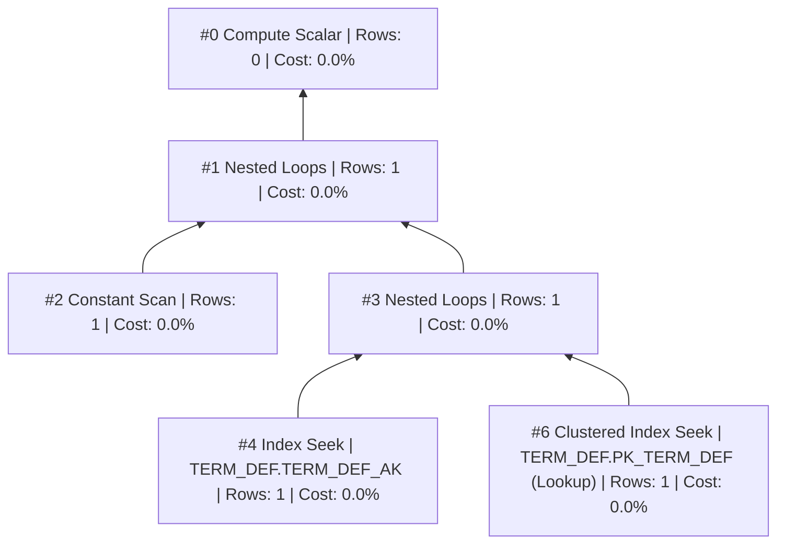
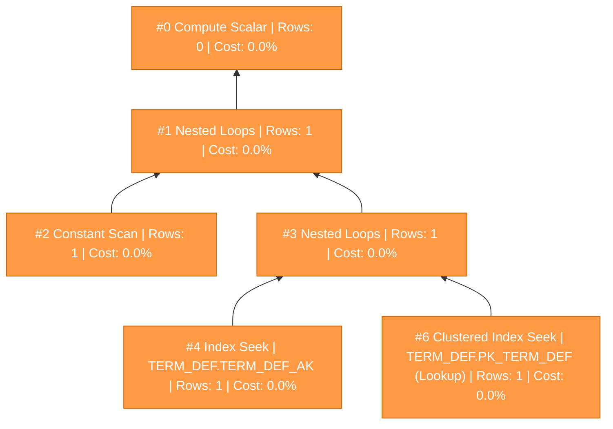
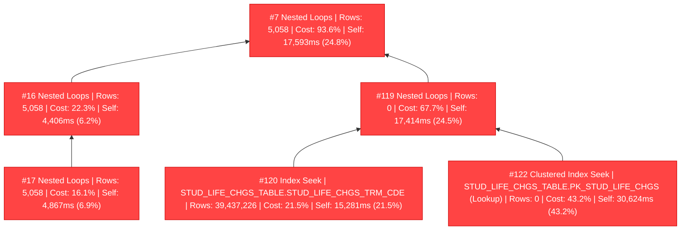

# SQL Execution Plan Analysis

**Source**: `querystats.xml`

---
## Statement 1 (SELECT)

```sql
DECLARE @CurrentTermSort INT = (SELECT TRM_SORT_ORDER FROM TERM_DEF WHERE TRM_CDE = @Term)
```

- **Elapsed**: 0ms | **CPU**: 0ms | **Est. Cost**: 0.00657582

- **DOP**: 1

### Full Execution Plan



### Problematic Nodes (by Exclusive Time)

| Node | Physical Op | Table.Index | Actual Rows | Rows Read | Self Time (ms) | Self % | Elapsed (ms) | Cost % | Logical Reads |
|------|-----------|-------------|-------------|-----------|---------------|--------|-------------|--------|---------------|
| 0 | Compute Scalar |  | 0 | 0 | 0 | 0.0% | 0 | 0.0% | 0 |
| 1 | Nested Loops |  | 1 | 0 | 0 | 0.0% | 0 | 0.0% | 0 |
| 2 | Constant Scan |  | 1 | 0 | 0 | 0.0% | 0 | 0.0% | 0 |
| 3 | Nested Loops |  | 1 | 0 | 0 | 0.0% | 0 | 0.0% | 0 |
| 4 | Index Seek | TERM_DEF.TERM_DEF_AK | 1 | 1 | 0 | 0.0% | 0 | 0.0% | 2 |
| 6 | Clustered Index Seek | TERM_DEF.PK_TERM_DEF (Lookup) | 1 | 1 | 0 | 0.0% | 0 | 0.0% | 2 |

#### Details

**Node 0 — Compute Scalar** (Self: 0ms / 0.0%)
- Actual rows: 0 | Rows read: 0
- Executions: 0
- Logical reads: 0 | Physical reads: 0
- Elapsed: 0ms (self: 0ms) | CPU: 0ms

**Node 1 — Nested Loops** (Self: 0ms / 0.0%)
- Actual rows: 1 | Rows read: 0
- Executions: 1
- Logical reads: 0 | Physical reads: 0
- Elapsed: 0ms (self: 0ms) | CPU: 0ms

**Node 2 — Constant Scan** (Self: 0ms / 0.0%)
- Actual rows: 1 | Rows read: 0
- Executions: 1
- Logical reads: 0 | Physical reads: 0
- Elapsed: 0ms (self: 0ms) | CPU: 0ms

**Node 3 — Nested Loops** (Self: 0ms / 0.0%)
- Actual rows: 1 | Rows read: 0
- Executions: 1
- Logical reads: 0 | Physical reads: 0
- Elapsed: 0ms (self: 0ms) | CPU: 0ms

**Node 4 — Index Seek** (Self: 0ms / 0.0%)
- Table: `TERM_DEF`
- Index: `TERM_DEF_AK`
- Actual rows: 1 | Rows read: 1
- Executions: 1
- Logical reads: 2 | Physical reads: 0
- Elapsed: 0ms (self: 0ms) | CPU: 0ms

**Node 6 — Clustered Index Seek** (Self: 0ms / 0.0%)
- Table: `TERM_DEF`
- Index: `PK_TERM_DEF`
- **Key Lookup** — consider covering index to avoid lookups
- Actual rows: 1 | Rows read: 1
- Executions: 1
- Logical reads: 2 | Physical reads: 0
- Elapsed: 0ms (self: 0ms) | CPU: 0ms

### Problematic Nodes Diagram



---
## Statement 2 (SELECT)

```sql
WITH peeps (ID_NUM) AS
        (
            SELECT DISTINCT sm.ID_NUM
            FROM STUDENT_MASTER sm
                INNER JOIN TRANS_HIST th ON sm.ID_NUM = th.ID_NUM
            WHERE th.CHG_YR_TRAN_HIST = @Year
                AND th.CHG_TRM_TRAN_HIST = @Term
        ),
        tranData (ID_NUM, TransPeriod, TransType, Amount) AS
        (
            SELECT
                th.ID_NUM,
                CASE
                    WHEN th.SUBSID_CDE IN ('AA')
                        AND (
     ...
```

- **Elapsed**: 76,786ms | **CPU**: 70,381ms | **Est. Cost**: 638.509

- **DOP**: 0
- **Memory Grant**: 69,440 KB (Used: 4,752 KB, 6%)
- **Non-Parallel Reason**: CouldNotGenerateValidParallelPlan

### Warnings

- **PlanAffectingConvert**: ConvertIssue=Cardinality Estimate | Expression=CONVERT(varchar(30),[Expr1124],0)
- **SpillToTempDb**: SpillLevel=1 | SpilledThreadCount=1
- **SortSpillDetails**: GrantedMemoryKb=544 | UsedMemoryKb=544 | WritesToTempDb=260 | ReadsFromTempDb=260

### Missing Index Suggestions

  - **Table**: `TmsEPrd.dbo.TRANS_HIST` (Impact: 99.5774%)
    - Equality: `CHG_TRM_TRAN_HIST, CHG_YR_TRAN_HIST`
    - Include: `ID_NUM`

### Wait Statistics

| Wait Type | Time (ms) | Count |
|-----------|-----------|-------|
| ASYNC_NETWORK_IO | 5803 | 26 |
| SOS_SCHEDULER_YIELD | 509 | 17471 |
| PAGEIOLATCH_SH | 102 | 194 |
| IO_COMPLETION | 29 | 29 |
| MEMORY_ALLOCATION_EXT | 8 | 11231 |
| RESERVED_MEMORY_ALLOCATION_EXT | 3 | 18037 |

### Full Execution Plan

```mermaid
flowchart BT
    S2N0["#0 Compute Scalar | Rows: 0 | Cost: 100.0%"]:::warm
    S2N1["#1 Sort | Rows: 5,058 | Cost: 100.0% | Self: 38ms (0.1%)"]:::warm
    S2N2["#2 Compute Scalar | Rows: 0 | Cost: 99.9%"]:::warm
    S2N3["#3 Nested Loops | Rows: 5,058 | Cost: 99.9% | Self: 1,970ms (2.8%)"]:::warm
    S2N4["#4 Nested Loops | Rows: 5,058 | Cost: 97.2% | Self: 2,306ms (3.2%)"]:::warm
    S2N5["#5 Nested Loops | Rows: 5,058 | Cost: 93.9% | Self: 103ms (0.1%)"]:::warm
    S2N6["#6 Sort | Rows: 5,058 | Cost: 93.8% | Self: 116ms (0.2%)"]:::warm
    S2N7["#7 Nested Loops | Rows: 5,058 | Cost: 93.6% | Self: 17,593ms (24.8%)"]:::hot
    S2N8["#8 Nested Loops | Rows: 5,058 | Cost: 24.8% | Self: 31ms (0.0%)"]
    S2N9["#9 Nested Loops | Rows: 5,058 | Cost: 24.7% | Self: 38ms (0.1%)"]
    S2N10["#10 Nested Loops | Rows: 5,058 | Cost: 24.7% | Self: 46ms (0.1%)"]
    S2N11["#11 Nested Loops | Rows: 5,058 | Cost: 24.6% | Self: 22ms (0.0%)"]
    S2N12["#12 Nested Loops | Rows: 5,058 | Cost: 24.6% | Self: 20ms (0.0%)"]
    S2N13["#13 Nested Loops | Rows: 5,058 | Cost: 24.5% | Self: 41ms (0.1%)"]
    S2N14["#14 Nested Loops | Rows: 5,058 | Cost: 24.5% | Self: 118ms (0.2%)"]
    S2N15["#15 Nested Loops | Rows: 5,058 | Cost: 24.3% | Self: 1,417ms (2.0%)"]
    S2N16["#16 Nested Loops | Rows: 5,058 | Cost: 22.3% | Self: 4,406ms (6.2%)"]:::hot
    S2N17["#17 Nested Loops | Rows: 5,058 | Cost: 16.1% | Self: 4,867ms (6.9%)"]:::hot
    S2N18["#18 Nested Loops | Rows: 5,058 | Cost: 9.2% | Self: 29ms (0.0%)"]
    S2N19["#19 Nested Loops | Rows: 5,058 | Cost: 9.2% | Self: 23ms (0.0%)"]
    S2N20["#20 Nested Loops | Rows: 5,060 | Cost: 9.2% | Self: 45ms (0.1%)"]
    S2N21["#21 Nested Loops | Rows: 5,060 | Cost: 9.1% | Self: 21ms (0.0%)"]
    S2N22["#22 Nested Loops | Rows: 5,060 | Cost: 9.1% | Self: 40ms (0.1%)"]
    S2N23["#23 Nested Loops | Rows: 5,060 | Cost: 9.0% | Self: 49ms (0.1%)"]
    S2N24["#24 Filter | Rows: 5,060 | Cost: 9.0% | Self: 3ms (0.0%)"]
    S2N25["#25 Stream Aggregate | Rows: 5,394 | Cost: 9.0% | Self: 520ms (0.7%)"]
    S2N26["#26 Nested Loops | Rows: 450,046 | Cost: 8.2% | Self: 1,053ms (1.5%)"]
    S2N27["#27 Compute Scalar | Rows: 0 | Cost: 6.7%"]
    S2N28["#28 Nested Loops | Rows: 450,046 | Cost: 6.7% | Self: 2,300ms (3.2%)"]
    S2N30["#30 Nested Loops | Rows: 905,439 | Cost: 3.5% | Self: 546ms (0.8%)"]
    S2N31["#31 Stream Aggregate | Rows: 5,395 | Cost: 2.7% | Self: 10ms (0.0%)"]
    S2N32["#32 Nested Loops | Rows: 132,094 | Cost: 2.7% | Self: 159ms (0.2%)"]
    S2N33["#33 Sort | Rows: 132,946 | Cost: 0.0%"]
    S2N34["#34 Clustered Index Scan | TRANS_HIST.PK_TRANS_HIST | Rows: 132,946 | Cost: 2.5% | Self: 1,765ms (2.5%)"]
    S2N35["#35 Index Seek | STUDENT_MASTER.STUDENT_MASTER_AK | Rows: 132,094 | Cost: 0.2% | Self: 125ms (0.2%)"]
    S2N36["#36 Index Seek | TRANS_HIST.TRANS_HIST_FK7 | Rows: 905,439 | Cost: 0.7% | Self: 517ms (0.7%)"]
    S2N38["#38 Clustered Index Seek | TRANS_HIST.PK_TRANS_HIST (Lookup) | Rows: 450,046 | Cost: 2.9% | Self: 2,042ms (2.9%)"]
    S2N39["#39 Clustered Index Scan | TERM_DEF.PK_TERM_DEF | Rows: 1,800,184 | Cost: 1.3% | Self: 919ms (1.3%)"]
    S2N40["#40 Index Seek | DEGREE_HISTORY.J1dxM1C1_DegHist_ID_NUM_C_47_4 | Rows: 5,060 | Cost: 0.1% | Self: 46ms (0.1%)"]
    S2N42["#42 Clustered Index Seek | DEGREE_HISTORY.PK_DEGREE_HISTORY (Lookup) | Rows: 5,060 | Cost: 0.0% | Self: 34ms (0.0%)"]
    S2N43["#43 Index Seek | NameMaster.NameMaster_AK | Rows: 5,060 | Cost: 0.0% | Self: 12ms (0.0%)"]
    S2N45["#45 Clustered Index Seek | NameMaster.PK_NameMaster (Lookup) | Rows: 5,060 | Cost: 0.0% | Self: 33ms (0.0%)"]
    S2N46["#46 Index Seek | STUDENT_MASTER.STUDENT_MASTER_AK | Rows: 5,058 | Cost: 0.0% | Self: 16ms (0.0%)"]
    S2N48["#48 Clustered Index Seek | STUDENT_MASTER.PK_STUDENT_MASTER (Lookup) | Rows: 5,058 | Cost: 0.0% | Self: 23ms (0.0%)"]
    S2N49["#49 Stream Aggregate | Rows: 5,058 | Cost: 6.8% | Self: 471ms (0.7%)"]
    S2N50["#50 Nested Loops | Rows: 437,547 | Cost: 6.2% | Self: 910ms (1.3%)"]
    S2N51["#51 Nested Loops | Rows: 437,547 | Cost: 4.9% | Self: 1,666ms (2.3%)"]
    S2N53["#53 Top | Rows: 5,058 | Cost: 2.3% | Self: 3ms (0.0%)"]
    S2N54["#54 Nested Loops | Rows: 5,058 | Cost: 2.3% | Self: 26ms (0.0%)"]
    S2N55["#55 Index Seek | STUDENT_MASTER.STUDENT_MASTER_AK | Rows: 5,058 | Cost: 0.0% | Self: 23ms (0.0%)"]
    S2N56["#56 Nested Loops | Rows: 5,058 | Cost: 2.3% | Self: 427ms (0.6%)"]
    S2N58["#58 Index Seek | TRANS_HIST.TRANS_HIST_FK7 | Rows: 742,841 | Cost: 0.4% | Self: 265ms (0.4%)"]
    S2N60["#60 Clustered Index Seek | TRANS_HIST.PK_TRANS_HIST (Lookup) | Rows: 5,058 | Cost: 1.7% | Self: 1,181ms (1.7%)"]
    S2N61["#61 Compute Scalar | Rows: 0 | Cost: 2.5%"]
    S2N62["#62 Nested Loops | Rows: 437,547 | Cost: 2.5% | Self: 487ms (0.7%)"]
    S2N64["#64 Index Seek | TRANS_HIST.TRANS_HIST_FK7 | Rows: 878,639 | Cost: 0.4% | Self: 264ms (0.4%)"]
    S2N66["#66 Clustered Index Seek | TRANS_HIST.PK_TRANS_HIST (Lookup) | Rows: 437,547 | Cost: 1.9% | Self: 1,316ms (1.9%)"]
    S2N67["#67 Clustered Index Scan | TERM_DEF.PK_TERM_DEF | Rows: 1,750,188 | Cost: 1.1% | Self: 795ms (1.1%)"]
    S2N68["#68 Stream Aggregate | Rows: 5,058 | Cost: 6.2% | Self: 285ms (0.4%)"]
    S2N69["#69 Nested Loops | Rows: 437,547 | Cost: 5.8% | Self: 866ms (1.2%)"]
    S2N70["#70 Nested Loops | Rows: 437,547 | Cost: 4.6% | Self: 1,451ms (2.0%)"]
    S2N72["#72 Top | Rows: 5,058 | Cost: 2.0% | Self: 5ms (0.0%)"]
    S2N73["#73 Nested Loops | Rows: 5,058 | Cost: 2.0% | Self: 24ms (0.0%)"]
    S2N74["#74 Index Seek | STUDENT_MASTER.STUDENT_MASTER_AK | Rows: 5,058 | Cost: 0.0% | Self: 16ms (0.0%)"]
    S2N75["#75 Nested Loops | Rows: 5,058 | Cost: 2.0% | Self: 342ms (0.5%)"]
    S2N77["#77 Index Seek | TRANS_HIST.TRANS_HIST_FK7 | Rows: 742,841 | Cost: 0.3% | Self: 211ms (0.3%)"]
    S2N79["#79 Clustered Index Seek | TRANS_HIST.PK_TRANS_HIST (Lookup) | Rows: 5,058 | Cost: 1.5% | Self: 1,060ms (1.5%)"]
    S2N80["#80 Compute Scalar | Rows: 0 | Cost: 2.5%"]
    S2N81["#81 Nested Loops | Rows: 437,547 | Cost: 2.5% | Self: 447ms (0.6%)"]
    S2N83["#83 Index Seek | TRANS_HIST.TRANS_HIST_FK7 | Rows: 878,639 | Cost: 0.4% | Self: 249ms (0.4%)"]
    S2N85["#85 Clustered Index Seek | TRANS_HIST.PK_TRANS_HIST (Lookup) | Rows: 437,547 | Cost: 1.9% | Self: 1,343ms (1.9%)"]
    S2N86["#86 Clustered Index Scan | TERM_DEF.PK_TERM_DEF | Rows: 1,750,188 | Cost: 1.0% | Self: 743ms (1.0%)"]
    S2N88["#88 Top | Rows: 5,058 | Cost: 1.9%"]
    S2N89["#89 Nested Loops | Rows: 5,058 | Cost: 1.9% | Self: 38ms (0.1%)"]
    S2N91["#91 Top | Rows: 5,058 | Cost: 1.9% | Self: 2ms (0.0%)"]
    S2N92["#92 Nested Loops | Rows: 5,058 | Cost: 1.9% | Self: 5ms (0.0%)"]
    S2N93["#93 Index Seek | STUDENT_MASTER.STUDENT_MASTER_AK | Rows: 5,058 | Cost: 0.0% | Self: 5ms (0.0%)"]
    S2N94["#94 Nested Loops | Rows: 5,058 | Cost: 1.9% | Self: 334ms (0.5%)"]
    S2N96["#96 Index Seek | TRANS_HIST.TRANS_HIST_FK7 | Rows: 742,841 | Cost: 0.3% | Self: 205ms (0.3%)"]
    S2N98["#98 Clustered Index Seek | TRANS_HIST.PK_TRANS_HIST (Lookup) | Rows: 5,058 | Cost: 1.4% | Self: 999ms (1.4%)"]
    S2N100["#100 Top | Rows: 5,058 | Cost: 0.1% | Self: 3ms (0.0%)"]
    S2N101["#101 Nested Loops | Rows: 5,058 | Cost: 0.0% | Self: 16ms (0.0%)"]
    S2N103["#103 Index Seek | TRANS_HIST.TRANS_HIST_FK7 | Rows: 9,247 | Cost: 0.0% | Self: 11ms (0.0%)"]
    S2N105["#105 Clustered Index Seek | TRANS_HIST.PK_TRANS_HIST (Lookup) | Rows: 5,058 | Cost: 0.0% | Self: 18ms (0.0%)"]
    S2N106["#106 Index Seek | AlternateContactMethod.J1dxAK2_AltCtcMthd | Rows: 5,052 | Cost: 0.2% | Self: 111ms (0.2%)"]
    S2N108["#108 Clustered Index Seek | AlternateContactMethod.PKAlternateContactMethod (Lookup) | Rows: 5,052 | Cost: 0.0% | Self: 34ms (0.0%)"]
    S2N109["#109 Index Seek | AlternateContactMethod.J1dxAK2_AltCtcMthd | Rows: 4,967 | Cost: 0.0% | Self: 13ms (0.0%)"]
    S2N111["#111 Clustered Index Seek | AlternateContactMethod.PKAlternateContactMethod (Lookup) | Rows: 4,967 | Cost: 0.0% | Self: 12ms (0.0%)"]
    S2N112["#112 Clustered Index Seek | BIOGRAPH_MASTER.PK_BIOGRAPH_MASTER | Rows: 5,058 | Cost: 0.1% | Self: 40ms (0.1%)"]
    S2N113["#113 Index Seek | STUDENT_DIV_MAST.STUDENT_DIV_MAST_AK | Rows: 5,058 | Cost: 0.0% | Self: 27ms (0.0%)"]
    S2N115["#115 Clustered Index Seek | STUDENT_DIV_MAST.PK_STUDENT_DIV_MAST (Lookup) | Rows: 5,058 | Cost: 0.0% | Self: 27ms (0.0%)"]
    S2N116["#116 Table Spool | Rows: 2,312 | Cost: 68.8% | Self: 46ms (0.1%)"]:::warm
    S2N117["#117 Concatenation | Rows: 2,312 | Cost: 68.8% | Self: 755ms (1.1%)"]:::warm
    S2N118["#118 Compute Scalar | Rows: 0 | Cost: 67.7%"]:::warm
    S2N119["#119 Nested Loops | Rows: 0 | Cost: 67.7% | Self: 17,414ms (24.5%)"]:::hot
    S2N120["#120 Index Seek | STUD_LIFE_CHGS_TABLE.STUD_LIFE_CHGS_TRM_CDE | Rows: 39,437,226 | Cost: 21.5% | Self: 15,281ms (21.5%)"]:::hot
    S2N122["#122 Clustered Index Seek | STUD_LIFE_CHGS_TABLE.PK_STUD_LIFE_CHGS (Lookup) | Rows: 0 | Cost: 43.2% | Self: 30,624ms (43.2%)"]:::hot
    S2N123["#123 Compute Scalar | Rows: 0 | Cost: 1.1%"]
    S2N124["#124 Nested Loops | Rows: 2,312 | Cost: 1.1% | Self: 336ms (0.5%)"]
    S2N125["#125 Compute Scalar | Rows: 0 | Cost: 0.6%"]
    S2N126["#126 Nested Loops | Rows: 2,312 | Cost: 0.6% | Self: 5ms (0.0%)"]
    S2N127["#127 Nested Loops | Rows: 2,312 | Cost: 0.6% | Self: 3ms (0.0%)"]
    S2N128["#128 Nested Loops | Rows: 2,312 | Cost: 0.6% | Self: 12ms (0.0%)"]
    S2N129["#129 Nested Loops | Rows: 2,312 | Cost: 0.6% | Self: 17ms (0.0%)"]
    S2N130["#130 Nested Loops | Rows: 2,312 | Cost: 0.5% | Self: 9ms (0.0%)"]
    S2N131["#131 Nested Loops | Rows: 2,312 | Cost: 0.5% | Self: 10ms (0.0%)"]
    S2N132["#132 Nested Loops | Rows: 2,312 | Cost: 0.5% | Self: 18ms (0.0%)"]
    S2N133["#133 Nested Loops | Rows: 2,312 | Cost: 0.5% | Self: 37ms (0.1%)"]
    S2N134["#134 Nested Loops | Rows: 6,405 | Cost: 0.4% | Self: 39ms (0.1%)"]
    S2N135["#135 Nested Loops | Rows: 10,531 | Cost: 0.4% | Self: 29ms (0.0%)"]
    S2N136["#136 Nested Loops | Rows: 10,531 | Cost: 0.3% | Self: 23ms (0.0%)"]
    S2N137["#137 Compute Scalar | Rows: 0 | Cost: 0.3%"]
    S2N138["#138 Nested Loops | Rows: 10,531 | Cost: 0.3% | Self: 22ms (0.0%)"]
    S2N139["#139 Nested Loops | Rows: 10,531 | Cost: 0.3% | Self: 47ms (0.1%)"]
    S2N140["#140 Nested Loops | Rows: 10,531 | Cost: 0.2% | Self: 58ms (0.1%)"]
    S2N141["#141 Nested Loops | Rows: 5,044 | Cost: 0.1% | Self: 37ms (0.1%)"]
    S2N142["#142 Index Seek | NameMaster.NameMaster_AK | Rows: 5,058 | Cost: 0.1% | Self: 36ms (0.1%)"]
    S2N143["#143 Index Seek | Person.PersonAK | Rows: 5,044 | Cost: 0.1% | Self: 45ms (0.1%)"]
    S2N144["#144 Index Seek | SAApplicantGroupStudent.SAApplicantGroupStudent_StudentPartyAppID | Rows: 10,531 | Cost: 0.1% | Self: 55ms (0.1%)"]
    S2N146["#146 Clustered Index Seek | SAApplicantGroupStudent.PK_SAApplicantGroupStudent (Lookup) | Rows: 10,531 | Cost: 0.1% | Self: 43ms (0.1%)"]
    S2N147["#147 Clustered Index Seek | SAStudentTypeDefinition.PKSAStudentTypeDefinition | Rows: 10,531 | Cost: 0.0% | Self: 19ms (0.0%)"]
    S2N148["#148 Clustered Index Seek | SAApplicantGroup.PK_SAApplicantGroup | Rows: 10,531 | Cost: 0.0% | Self: 19ms (0.0%)"]
    S2N149["#149 Clustered Index Seek | CM_SESSION_MSTR.PK_CM_SESSION_MSTR | Rows: 10,531 | Cost: 0.0% | Self: 26ms (0.0%)"]
    S2N150["#150 Index Seek | SESS_TABLE.SESS_TABLE_SESS_CDE | Rows: 6,405 | Cost: 0.0% | Self: 31ms (0.0%)"]
    S2N152["#152 Clustered Index Seek | SESS_TABLE.PK_SESS_TABLE (Lookup) | Rows: 2,312 | Cost: 0.0% | Self: 33ms (0.0%)"]
    S2N153["#153 Index Seek | SARoomAssign.J1dxAK_SARmAssAsgn | Rows: 794 | Cost: 0.0% | Self: 12ms (0.0%)"]
    S2N155["#155 Clustered Index Seek | SARoomAssign.PK_SARoomAssign (Lookup) | Rows: 794 | Cost: 0.0% | Self: 7ms (0.0%)"]
    S2N156["#156 Clustered Index Seek | SASessionFacilitySpace.PKSASessionFacilitySpace | Rows: 794 | Cost: 0.0% | Self: 9ms (0.0%)"]
    S2N157["#157 Clustered Index Seek | TABLE_DETAIL.PK_TABLE_DETAIL | Rows: 794 | Cost: 0.0% | Self: 12ms (0.0%)"]
    S2N158["#158 Clustered Index Seek | FacilitySpace.PKFacilitySpace | Rows: 794 | Cost: 0.0% | Self: 9ms (0.0%)"]
    S2N159["#159 Clustered Index Seek | Facility.PKFacility | Rows: 794 | Cost: 0.0% | Self: 2ms (0.0%)"]
    S2N160["#160 Clustered Index Seek | MealPlanDefinition.PK_MealPlanDefinition | Rows: 805 | Cost: 0.0% | Self: 4ms (0.0%)"]
    S2N161["#161 Index Scan | ROOM_MASTER.ROOM_MASTER_AK | Rows: 794 | Cost: 0.5% | Self: 330ms (0.5%)"]
    S2N162["#162 Index Spool | Rows: 1,947 | Cost: 0.1% | Self: 48ms (0.1%)"]
    S2N163["#163 Compute Scalar | Rows: 0 | Cost: 0.1%"]
    S2N164["#164 Stream Aggregate | Rows: 1,947 | Cost: 0.1% | Self: 1ms (0.0%)"]
    S2N165["#165 Sort | Rows: 2,745 | Cost: 0.1% | Self: 4ms (0.0%)"]
    S2N166["#166 Nested Loops | Rows: 2,760 | Cost: 0.1% | Self: 13ms (0.0%)"]
    S2N167["#167 Index Seek | HOLD_TRAN.J1dxM1_HldTran_COL_2_6_7 | Rows: 2,760 | Cost: 0.0% | Self: 35ms (0.0%)"]
    S2N169["#169 Clustered Index Seek | HOLD_TRAN.PK_HOLD_TRAN (Lookup) | Rows: 2,760 | Cost: 0.0% | Self: 12ms (0.0%)"]
    S2N170["#170 Index Spool | Rows: 4,500 | Cost: 3.2% | Self: 27ms (0.0%)"]
    S2N171["#171 Compute Scalar | Rows: 0 | Cost: 3.2%"]
    S2N172["#172 Stream Aggregate | Rows: 4,500 | Cost: 3.2% | Self: 3ms (0.0%)"]
    S2N173["#173 Nested Loops | Rows: 16,141 | Cost: 3.2% | Self: 146ms (0.2%)"]
    S2N175["#175 Top | Rows: 5,058 | Cost: 3.0% | Self: 1ms (0.0%)"]
    S2N176["#176 Nested Loops | Rows: 5,058 | Cost: 3.0% | Self: 12ms (0.0%)"]
    S2N177["#177 Index Seek | STUDENT_MASTER.STUDENT_MASTER_AK | Rows: 5,058 | Cost: 0.0% | Self: 7ms (0.0%)"]
    S2N178["#178 Nested Loops | Rows: 5,058 | Cost: 3.0% | Self: 672ms (0.9%)"]
    S2N180["#180 Index Seek | TRANS_HIST.TRANS_HIST_FK7 | Rows: 742,841 | Cost: 0.7% | Self: 528ms (0.7%)"]
    S2N182["#182 Clustered Index Seek | TRANS_HIST.PK_TRANS_HIST (Lookup) | Rows: 5,058 | Cost: 2.0% | Self: 1,438ms (2.0%)"]
    S2N183["#183 Nested Loops | Rows: 16,141 | Cost: 0.2% | Self: 83ms (0.1%)"]
    S2N185["#185 Index Seek | STUDENT_CRS_HIST.STUDENT_CRS_LIST | Rows: 16,141 | Cost: 0.1% | Self: 55ms (0.1%)"]
    S2N187["#187 Clustered Index Seek | STUDENT_CRS_HIST.PK_STUDENT_CRS_HIST (Lookup) | Rows: 16,141 | Cost: 0.1% | Self: 43ms (0.1%)"]
    S2N188["#188 Index Spool | Rows: 4,573 | Cost: 2.8% | Self: 42ms (0.1%)"]
    S2N189["#189 Compute Scalar | Rows: 0 | Cost: 2.7%"]
    S2N190["#190 Compute Scalar | Rows: 0 | Cost: 2.7%"]
    S2N191["#191 Stream Aggregate | Rows: 4,573 | Cost: 2.7% | Self: 4ms (0.0%)"]
    S2N192["#192 Merge Join | Rows: 74,546 | Cost: 2.7% | Self: 423ms (0.6%)"]
    S2N193["#193 Nested Loops | Rows: 5,058 | Cost: 2.1% | Self: 8ms (0.0%)"]
    S2N194["#194 Index Seek | STUDENT_MASTER.STUDENT_MASTER_AK | Rows: 5,058 | Cost: 0.0% | Self: 5ms (0.0%)"]
    S2N196["#196 Top | Rows: 5,058 | Cost: 2.1%"]
    S2N197["#197 Nested Loops | Rows: 5,058 | Cost: 2.1% | Self: 12ms (0.0%)"]
    S2N198["#198 Index Seek | STUDENT_MASTER.STUDENT_MASTER_AK | Rows: 5,058 | Cost: 0.0% | Self: 10ms (0.0%)"]
    S2N199["#199 Nested Loops | Rows: 5,058 | Cost: 2.1% | Self: 390ms (0.5%)"]
    S2N201["#201 Index Seek | TRANS_HIST.TRANS_HIST_FK7 | Rows: 742,841 | Cost: 0.4% | Self: 261ms (0.4%)"]
    S2N203["#203 Clustered Index Seek | TRANS_HIST.PK_TRANS_HIST (Lookup) | Rows: 5,058 | Cost: 1.5% | Self: 1,082ms (1.5%)"]
    S2N204["#204 Sort | Rows: 75,518 | Cost: 0.6% | Self: 61ms (0.1%)"]
    S2N205["#205 Nested Loops | Rows: 83,191 | Cost: 0.5% | Self: 127ms (0.2%)"]
    S2N207["#207 Index Seek | STUDENT_CRS_HIST.STUDENT_CRS_LIST | Rows: 90,514 | Cost: 0.2% | Self: 111ms (0.2%)"]
    S2N209["#209 Clustered Index Seek | STUDENT_CRS_HIST.PK_STUDENT_CRS_HIST (Lookup) | Rows: 83,191 | Cost: 0.3% | Self: 218ms (0.3%)"]
    S2N1 --> S2N0
    S2N2 --> S2N1
    S2N3 --> S2N2
    S2N4 --> S2N3
    S2N5 --> S2N4
    S2N6 --> S2N5
    S2N7 --> S2N6
    S2N8 --> S2N7
    S2N9 --> S2N8
    S2N10 --> S2N9
    S2N11 --> S2N10
    S2N12 --> S2N11
    S2N13 --> S2N12
    S2N14 --> S2N13
    S2N15 --> S2N14
    S2N16 --> S2N15
    S2N17 --> S2N16
    S2N18 --> S2N17
    S2N19 --> S2N18
    S2N20 --> S2N19
    S2N21 --> S2N20
    S2N22 --> S2N21
    S2N23 --> S2N22
    S2N24 --> S2N23
    S2N25 --> S2N24
    S2N26 --> S2N25
    S2N27 --> S2N26
    S2N28 --> S2N27
    S2N30 --> S2N28
    S2N31 --> S2N30
    S2N32 --> S2N31
    S2N33 --> S2N32
    S2N34 --> S2N33
    S2N35 --> S2N32
    S2N36 --> S2N30
    S2N38 --> S2N28
    S2N39 --> S2N26
    S2N40 --> S2N23
    S2N42 --> S2N22
    S2N43 --> S2N21
    S2N45 --> S2N20
    S2N46 --> S2N19
    S2N48 --> S2N18
    S2N49 --> S2N17
    S2N50 --> S2N49
    S2N51 --> S2N50
    S2N53 --> S2N51
    S2N54 --> S2N53
    S2N55 --> S2N54
    S2N56 --> S2N54
    S2N58 --> S2N56
    S2N60 --> S2N56
    S2N61 --> S2N51
    S2N62 --> S2N61
    S2N64 --> S2N62
    S2N66 --> S2N62
    S2N67 --> S2N50
    S2N68 --> S2N16
    S2N69 --> S2N68
    S2N70 --> S2N69
    S2N72 --> S2N70
    S2N73 --> S2N72
    S2N74 --> S2N73
    S2N75 --> S2N73
    S2N77 --> S2N75
    S2N79 --> S2N75
    S2N80 --> S2N70
    S2N81 --> S2N80
    S2N83 --> S2N81
    S2N85 --> S2N81
    S2N86 --> S2N69
    S2N88 --> S2N15
    S2N89 --> S2N88
    S2N91 --> S2N89
    S2N92 --> S2N91
    S2N93 --> S2N92
    S2N94 --> S2N92
    S2N96 --> S2N94
    S2N98 --> S2N94
    S2N100 --> S2N89
    S2N101 --> S2N100
    S2N103 --> S2N101
    S2N105 --> S2N101
    S2N106 --> S2N14
    S2N108 --> S2N13
    S2N109 --> S2N12
    S2N111 --> S2N11
    S2N112 --> S2N10
    S2N113 --> S2N9
    S2N115 --> S2N8
    S2N116 --> S2N7
    S2N117 --> S2N116
    S2N118 --> S2N117
    S2N119 --> S2N118
    S2N120 --> S2N119
    S2N122 --> S2N119
    S2N123 --> S2N117
    S2N124 --> S2N123
    S2N125 --> S2N124
    S2N126 --> S2N125
    S2N127 --> S2N126
    S2N128 --> S2N127
    S2N129 --> S2N128
    S2N130 --> S2N129
    S2N131 --> S2N130
    S2N132 --> S2N131
    S2N133 --> S2N132
    S2N134 --> S2N133
    S2N135 --> S2N134
    S2N136 --> S2N135
    S2N137 --> S2N136
    S2N138 --> S2N137
    S2N139 --> S2N138
    S2N140 --> S2N139
    S2N141 --> S2N140
    S2N142 --> S2N141
    S2N143 --> S2N141
    S2N144 --> S2N140
    S2N146 --> S2N139
    S2N147 --> S2N138
    S2N148 --> S2N136
    S2N149 --> S2N135
    S2N150 --> S2N134
    S2N152 --> S2N133
    S2N153 --> S2N132
    S2N155 --> S2N131
    S2N156 --> S2N130
    S2N157 --> S2N129
    S2N158 --> S2N128
    S2N159 --> S2N127
    S2N160 --> S2N126
    S2N161 --> S2N124
    S2N162 --> S2N5
    S2N163 --> S2N162
    S2N164 --> S2N163
    S2N165 --> S2N164
    S2N166 --> S2N165
    S2N167 --> S2N166
    S2N169 --> S2N166
    S2N170 --> S2N4
    S2N171 --> S2N170
    S2N172 --> S2N171
    S2N173 --> S2N172
    S2N175 --> S2N173
    S2N176 --> S2N175
    S2N177 --> S2N176
    S2N178 --> S2N176
    S2N180 --> S2N178
    S2N182 --> S2N178
    S2N183 --> S2N173
    S2N185 --> S2N183
    S2N187 --> S2N183
    S2N188 --> S2N3
    S2N189 --> S2N188
    S2N190 --> S2N189
    S2N191 --> S2N190
    S2N192 --> S2N191
    S2N193 --> S2N192
    S2N194 --> S2N193
    S2N196 --> S2N193
    S2N197 --> S2N196
    S2N198 --> S2N197
    S2N199 --> S2N197
    S2N201 --> S2N199
    S2N203 --> S2N199
    S2N204 --> S2N192
    S2N205 --> S2N204
    S2N207 --> S2N205
    S2N209 --> S2N205
    classDef hot fill:#ff4444,color:#fff,stroke:#cc0000
    classDef warm fill:#ff9944,color:#fff,stroke:#cc6600
```

### Problematic Nodes (by Exclusive Time)

| Node | Physical Op | Table.Index | Actual Rows | Rows Read | Self Time (ms) | Self % | Elapsed (ms) | Cost % | Logical Reads |
|------|-----------|-------------|-------------|-----------|---------------|--------|-------------|--------|---------------|
| 122 | Clustered Index Seek | STUD_LIFE_CHGS_TABLE.PK_STUD_LIFE_CHGS (Lookup) | 0 | 39,437,226 | 30,624 | 43.2% | 30,624 | 43.2% | 78,874,452 |
| 7 | Nested Loops |  | 5,058 | 0 | 17,593 | 24.8% | 66,432 | 93.6% | 0 |
| 119 | Nested Loops |  | 0 | 0 | 17,414 | 24.5% | 48,038 | 67.7% | 0 |
| 120 | Index Seek | STUD_LIFE_CHGS_TABLE.STUD_LIFE_CHGS_TRM_CDE | 39,437,226 | 39,437,226 | 15,281 | 21.5% | 15,281 | 21.5% | 101,160 |
| 17 | Nested Loops |  | 5,058 | 0 | 4,867 | 6.9% | 11,430 | 16.1% | 0 |
| 16 | Nested Loops |  | 5,058 | 0 | 4,406 | 6.2% | 15,836 | 22.3% | 0 |

#### Details

**Node 122 — Clustered Index Seek** (Self: 30,624ms / 43.2%)
- Table: `STUD_LIFE_CHGS_TABLE`
- Index: `PK_STUD_LIFE_CHGS`
- **Key Lookup** — consider covering index to avoid lookups
- Actual rows: 0 | Rows read: 39,437,226
- Executions: 39,437,226
- Logical reads: 78,874,452 | Physical reads: 0
- Elapsed: 30,624ms (self: 30,624ms) | CPU: 30,354ms

**Node 7 — Nested Loops** (Self: 17,593ms / 24.8%)
- Actual rows: 5,058 | Rows read: 0
- Executions: 1
- Logical reads: 0 | Physical reads: 0
- Elapsed: 66,432ms (self: 17,593ms) | CPU: 65,956ms

**Node 119 — Nested Loops** (Self: 17,414ms / 24.5%)
- Actual rows: 0 | Rows read: 0
- Executions: 5,058
- Logical reads: 0 | Physical reads: 0
- Elapsed: 48,038ms (self: 17,414ms) | CPU: 47,765ms

**Node 120 — Index Seek** (Self: 15,281ms / 21.5%)
- Table: `STUD_LIFE_CHGS_TABLE`
- Index: `STUD_LIFE_CHGS_TRM_CDE`
- Actual rows: 39,437,226 | Rows read: 39,437,226
- Executions: 5,058
- Logical reads: 101,160 | Physical reads: 3
- Elapsed: 15,281ms (self: 15,281ms) | CPU: 15,279ms

**Node 17 — Nested Loops** (Self: 4,867ms / 6.9%)
- Actual rows: 5,058 | Rows read: 0
- Executions: 1
- Logical reads: 0 | Physical reads: 0
- Elapsed: 11,430ms (self: 4,867ms) | CPU: 11,337ms

**Node 16 — Nested Loops** (Self: 4,406ms / 6.2%)
- Actual rows: 5,058 | Rows read: 0
- Executions: 1
- Logical reads: 0 | Physical reads: 0
- Elapsed: 15,836ms (self: 4,406ms) | CPU: 15,711ms

### Problematic Nodes Diagram


